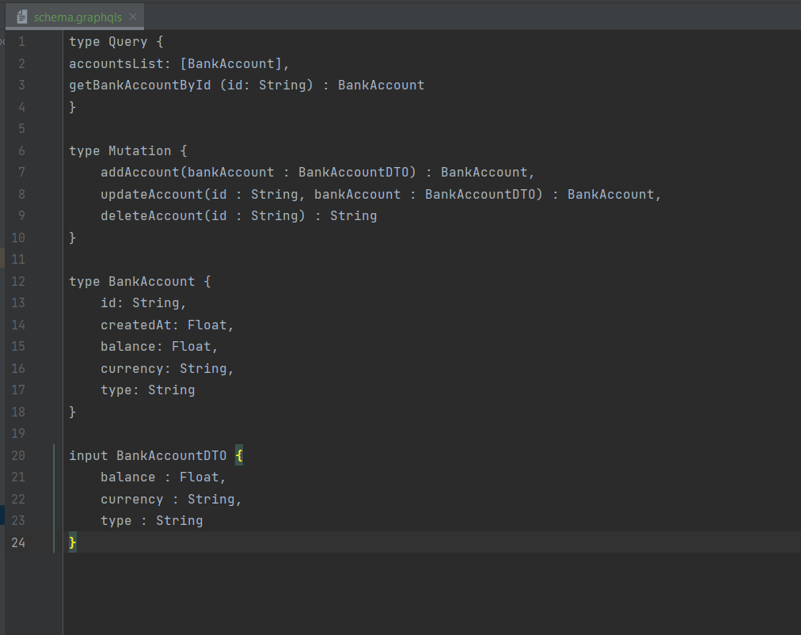
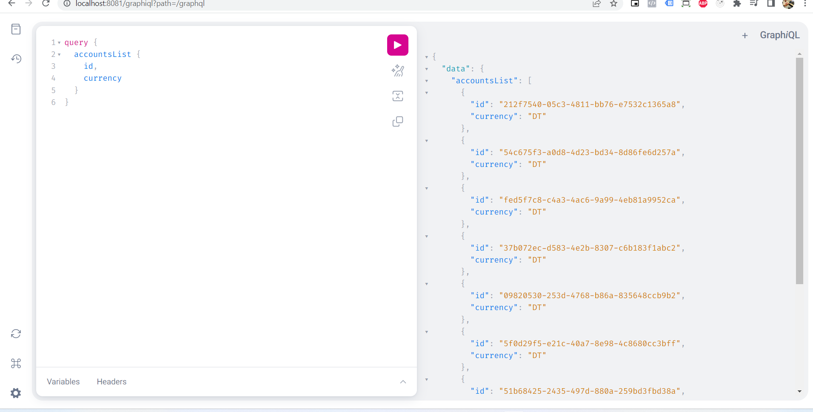
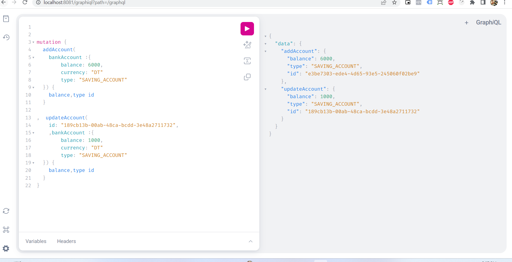
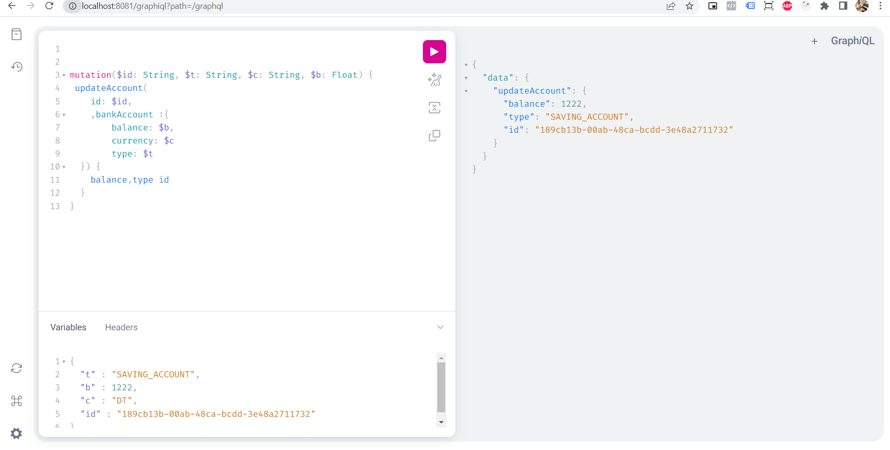
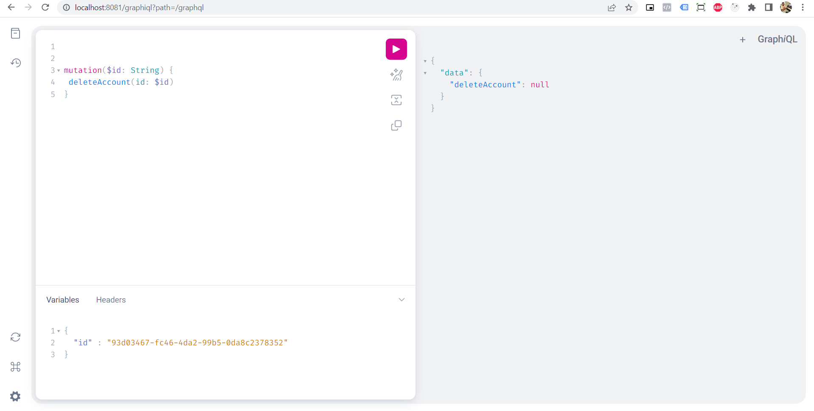

# SpringBoot-GraphQl

 
A Simple SpringBoot GraphQl application

### Api Documentation - Swagger Url :
http://localhost:8081/swagger-ui/index.html  

### Graphql Url :
http://localhost:8081/graphiql
 

#### How to create schema for graphqls (see the image below) :  

 
 
#### How to create graphQL Queries :
 
 GraphQL queries typically start with a "{" character. Lines that start
 with a # are ignored.
 
 An example GraphQL query might look like:
 

     {
       field(arg: "value") {
         subField
       }
     }

##### Keyboard shortcuts:
  

   Prettify query:  Shift-Ctrl-P (or press the prettify button)
    

  Merge fragments:  Shift-Ctrl-M (or press the merge button)
   

        Run Query:  Ctrl-Enter (or press the play button)

    Auto Complete:  Ctrl-Space (or just start typing)

  See the images below for more explanation about how graphiql works :  

   

   

   
